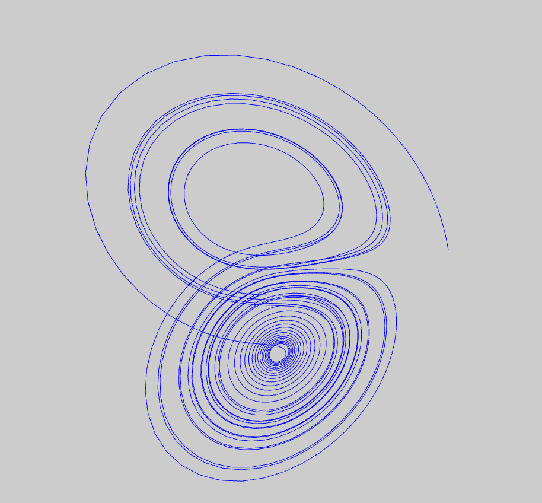

# 3D simulation of Lorenz system.

3D visualisation of the Lorenz attractor.
Please see: https://en.wikipedia.org/wiki/Lorenz_system for a thorough explanation.

# Note:

p=28, b=8/3, sigma=10.
Large time step increases result in a large error.

# Technologies used:

- BabylonJS
